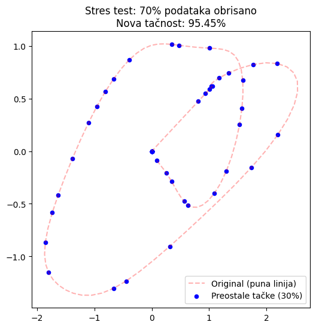
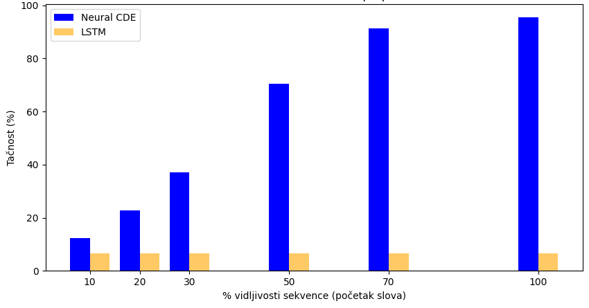
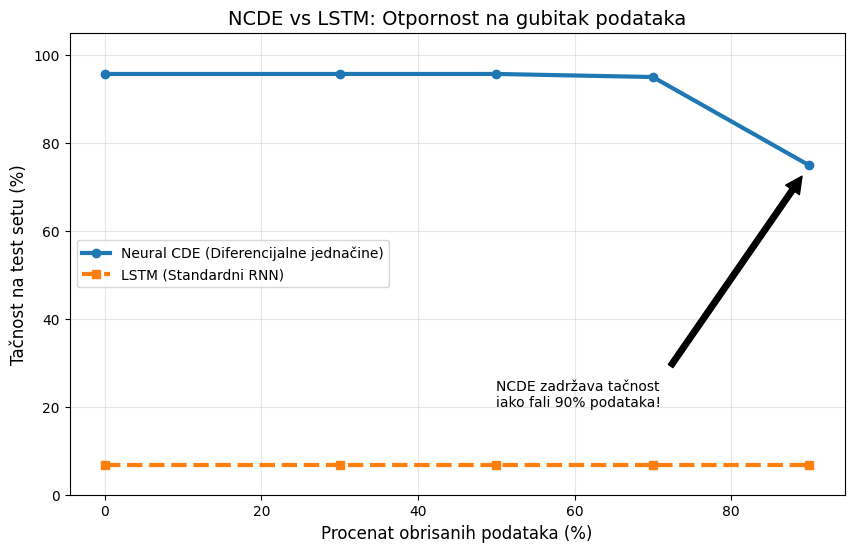

# Neural Controlled Differential Equations for Robust Time Series Prediction

This repository contains a PyTorch implementation and reproduction of the paper:  
**"Neural Controlled Differential Equations for Irregular Time Series"** (Kidger et al., NeurIPS 2020).

The project focuses on demonstrating the mathematical and engineering advantages of modeling time series as continuous paths using differential equations, specifically comparing **Neural CDEs** against traditional **LSTMs**.

## Key Features
- **Continuous-time Modeling:** Uses Natural Cubic Splines to handle irregular sampling.
- **Robustness Analysis:** Extensive stress tests involving missing data (up to 90% dropout) and Gaussian noise (jitter).
- **Multi-task Architecture:** Includes models for both **Classification** and **Future Trajectory Forecasting**.
- **Latent Dynamics Visualization:** Plots of vector fields and latent state evolution.

## Performance & Comparison
The NCDE model demonstrates a significant "Robustness Gap" compared to recurrent architectures like LSTMs.

| Metric | Neural CDE | LSTM |
| :--- | :---: | :---: |
| Baseline Accuracy | **95.63%** | 6.64%* |
| Accuracy with 70% Missing Data | **95.45%** | < 10% |
| Early Classification (at 40% length) | **~70%** | < 10% |

*\*LSTM baseline fails on irregular/padded sequences without significant imputation and task-specific tuning.*

## Visualizations
### 1. Robustness to Missing Data
NCDE maintains near-nominal accuracy even when 70% of the input points are removed, effectively "bridging the gaps" using learned dynamics.



A visual example of a "stressed" input trajectory. Despite 70% of the observations being removed at random, the Neural CDE model successfully classifies the character by reconstructing the continuous latent path from the sparse remaining points. Unlike discrete models that would require imputation to fill these gaps, the NCDE treats the input as a continuous control signal, making it naturally immune to missing values.

### 2. Early Classification: Proactive Decision Making
NCDE shows superior performance in "Early Classification" tasks. It reaches over 70% accuracy seeing only 50% of the trajectory.



The standard LSTM fails to generalize on partial or padded sequences, remaining at baseline chance levels (~5-7%). The NCDE, however, models the dynamics of the movement, allowing it to "guess" the intent of the writer long before the stroke is finished.

### 3. The Robustness Gap: NCDE vs. LSTM
A performance benchmark across various levels of data loss. The Neural CDE maintains near-nominal accuracy (~95%) up to 70% data loss and remains highly functional even at 90% loss.



The "Robustness Gap" highlighted by the arrow shows that while LSTMs are restricted by fixed-step hidden state updates, the NCDE's adaptive ODE solver adjusts its integration steps based on the continuity of the input spline, effectively "bridging the gap" where data is missing.

## 🛠️ Implementation Details
- **Framework:** PyTorch & `torchcde`
- **Dataset:** Character Trajectories (UEA Time Series Archive)
- **Integration:** Adaptive ODE Solvers (Dormand-Prince)
- **Environment:** Developed and tested in Google Colab

## 📖 Citation
```bibtex
@article{kidger2020neuralcde,
  title={Neural Controlled Differential Equations for Irregular Time Series},
  author={Kidger, Patrick and Morrill, James and Foster, James and Lyons, Terry},
  journal={Advances in Neural Information Processing Systems},
  year={2020}
}
